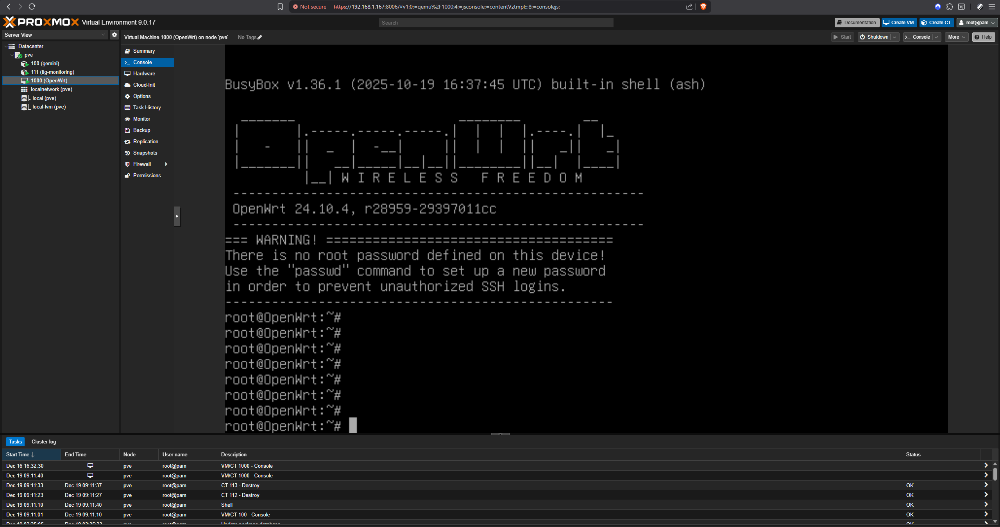
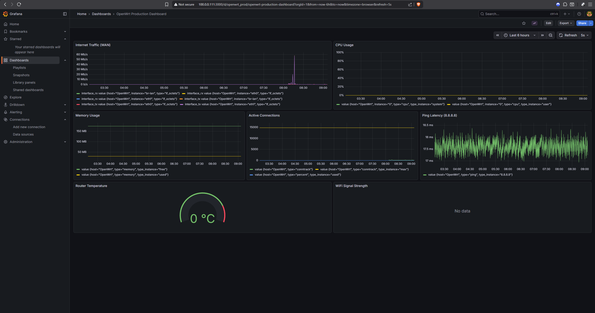
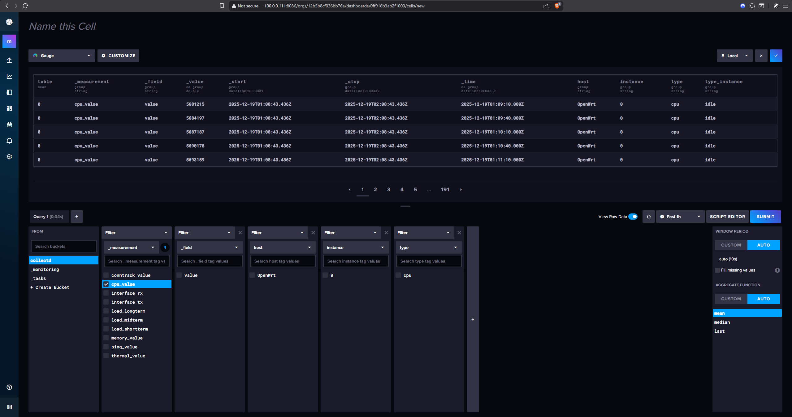
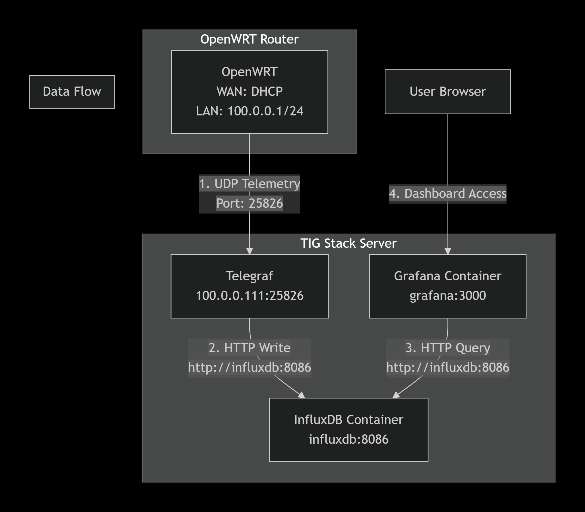

# Panduan Instalasi Manual: OpenWrt & TIG Stack (Monitoring)

Dokumen ini adalah panduan lengkap untuk menginstal dan mengonfigurasi OpenWrt serta TIG Stack (Telegraf, InfluxDB, Grafana) secara **manual** langkah-demi-langkah di Proxmox VE.

> **Catatan:** Panduan ini diperuntukkan bagi pengguna yang ingin memahami proses instalasi dari dasar tanpa bantuan script otomatis.

---

## Tabel Alokasi IP & Port
Berikut adalah gambaran arsitektur jaringan yang akan kita bangun:

| Komponen | Hostname | Interface | IP Address | Port Service |
| :--- | :--- | :--- | :--- | :--- |
| **OpenWrt** | `OpenWrt` | `lan` | `100.0.0.1` | - |
| **TIG Stack** | `tig-monitoring` | `eth0` | `100.0.0.111` | InfluxDB: `8086`, Grafana: `3000`, Telegraf: `25826/udp` |

> **Catatan Akses:** Untuk mengakses Web UI OpenWrt atau Grafana, komputer/laptop Anda harus berada dalam satu jaringan (subnet) dengan IP di atas (misal set IP statis laptop ke `100.0.0.2` gateway `100.0.0.1`).

---

## Prasyarat (Prerequisites)

1.  **Proxmox VE** (Login sebagai `root`).
2.  **Network Bridge**:
    *   `vmbr0`: Terhubung ke Internet (WAN).
    *   `vmbrlan`: Bridge internal untuk LAN.
3.  **Terminal**:
    *   `[Proxmox]`: Shell Proxmox.
    *   `[OpenWrt]`: Console VM OpenWrt.
    *   `[CT-TIG]`: Console Container Debian.

---

# BAGIAN A: OpenWrt (VM Setup & Config)

### 1. Download & Persiapan Image
Di Terminal Proxmox:

```bash
[Proxmox] # cd /var/lib/vz/template/iso
[Proxmox] # wget -O openwrt.img.gz https://downloads.openwrt.org/releases/24.10.4/targets/x86/64/openwrt-24.10.4-x86-64-generic-ext4-combined.img.gz
[Proxmox] # gunzip openwrt.img.gz
[Proxmox] # qemu-img resize -f raw openwrt.img 1G
```

### 2. Resize Partisi (Via Host Proxmox)
Untuk mempermudah proses, kita resize partisi langsung dari Proxmox **sebelum** VM dibuat. Ini lebih mudah daripada melakukan resize di dalam VM yang sedang berjalan.

```bash
# 1. Mount image ke loop device
[Proxmox] # LOOPDEV=$(losetup -fP --show openwrt.img)
# 2. Resize partisi root (biasanya nomor 2)
[Proxmox] # parted -s "$LOOPDEV" resizepart 2 100%
# 3. Resize filesystem
[Proxmox] # e2fsck -f -p "${LOOPDEV}p2"
[Proxmox] # resize2fs "${LOOPDEV}p2"
# 4. Lepas loop device
[Proxmox] # losetup -d "$LOOPDEV"
```

### 3. Buat VM di Proxmox
```bash
[Proxmox] # qm create 1000 --name "OpenWrt" --ostype l26 \
  --memory 256 --cpu host --cores 1 \
  --net0 virtio,bridge=vmbr0 \
  --net1 virtio,bridge=vmbrlan \
  --serial0 socket --vga serial0

[Proxmox] # qm importdisk 1000 openwrt.img local-lvm
[Proxmox] # qm set 1000 --scsi0 local-lvm:vm-1000-disk-0
[Proxmox] # qm set 1000 --boot c --bootdisk scsi0 --onboot 1
[Proxmox] # qm start 1000
```

### 4. Konfigurasi Network OpenWrt
Buka Console VM 1000. Tekan Enter.

**Tutorial Singkat Editor `vi`:**
*   Buka file: `vi namafile`
*   Masuk mode edit: Tekan tombol **`i`**.
*   Keluar mode edit: Tekan tombol **`Esc`**.
*   Simpan & Keluar: Tekan **`Esc`** lalu ketik **`:wq`** lalu **Enter**.
*   Keluar tanpa simpan: Tekan **`Esc`** lalu ketik **`:q!`** lalu **Enter**.

Edit network:
```bash
[OpenWrt] # vi /etc/config/network
```
Sesuaikan:
```conf
config interface 'wan'
    option device 'eth0'
    option proto 'dhcp'

config interface 'lan'
    option device 'eth1'
    option proto 'static'
    option ipaddr '100.0.0.1'
    option netmask '255.255.255.0'
```
Restart: `service network restart`.

### 5. Install & Config Plugin Monitoring
```bash
[OpenWrt] # opkg update
[OpenWrt] # opkg install collectd collectd-mod-network collectd-mod-cpu \
collectd-mod-memory collectd-mod-load collectd-mod-interface \
collectd-mod-ping collectd-mod-thermal
```

Edit config collectd:
```bash
[OpenWrt] # vi /etc/collectd.conf
```
Ubah bagian `LoadPlugin network`:
```apache
LoadPlugin network
<Plugin network>
    Server "100.0.0.111" "25826"
</Plugin>
```
Restart: `/etc/init.d/collectd restart`.

---

# BAGIAN B: CT TIG (Monitoring Stack)

Kita akan membuat Container (LXC) berbasis Debian.

### 1. Download Template & Buat Container
Di sini kita menggunakan **Debian 13 (Trixie)** sebagai contoh (sesuai dengan versi yang digunakan di script otomatis), namun Debian 12 (Bookworm) juga bisa digunakan.

```bash
# 1. Update daftar template
[Proxmox] # pveam update
# 2. Cari nama file template Debian 13 yang tersedia
[Proxmox] # pveam available | grep debian-13
# Output contoh: debian-13-standard_13.0-1_amd64.tar.zst
# 3. Download template tersebut (sesuaikan nama file jika beda)
[Proxmox] # pveam download local debian-13-standard_13.0-1_amd64.tar.zst
```

Buat Container:
```bash
[Proxmox] # pct create 111 local:vztmpl/debian-13-standard_13.0-1_amd64.tar.zst \
  --hostname tig-monitoring --cores 2 --memory 2048 \
  --net0 name=eth0,bridge=vmbrlan,ip=100.0.0.111/24,gw=100.0.0.1 \
  --features nesting=1,keyctl=1 \
  --storage local-lvm --start 1 --unprivileged 1
```

### 2. Install Docker
Masuk ke Console CT 111. Kita butuh Docker untuk menjalankan TIG Stack dalam container terisolasi.
```bash
[CT-TIG] # apt-get update && apt-get install -y curl
[CT-TIG] # curl -fsSL https://get.docker.com | sh
[CT-TIG] # mkdir -p /root/tig-stack
[CT-TIG] # cd /root/tig-stack
```

---

# BAGIAN B (Lanjutan): Konfigurasi TIG Stack

### 1. Download `types.db` (Wajib)
**Mengapa butuh file ini?**
Plugin `collectd` mengirim data dalam format binary yang sangat ringkas tanpa menyertakan nama/tipe data. Telegraf membutuhkan "kamus" (`types.db`) ini untuk bisa menerjemahkan data binary tersebut menjadi metric yang bisa dibaca (misal: kode `1` adalah `cpu`, kode `2` adalah `memory`). Tanpa file ini, Telegraf akan error.

```bash
[CT-TIG] # curl -s -o types.db https://raw.githubusercontent.com/collectd/collectd/master/src/types.db
```

### 2. Buat `telegraf.conf`
**Penting - Mengenai Token & Organisasi:**
Di konfigurasi ini, kita sudah menuliskan `token = "telkom123telkom123"` dan `organization = "my-org"`.
Anda mungkin bertanya, **"Dari mana kita dapat token ini padahal InfluxDB belum diinstall?"**

Jawabannya: Kita akan mendefinisikan token ini secara **eksplisit** saat membuat container InfluxDB nanti (di langkah `docker-compose.yml`). Jadi saat InfluxDB pertama kali menyala, dia akan langsung membuat user admin dengan token tersebut. Ini disebut teknik *pre-provisioning*.

```bash
[CT-TIG] # nano telegraf.conf
```
Isi:
```toml
[agent] 
  # Interval pengambilan data. Default 30 detik.
  interval = "30s"
  hostname = "tig-monitoring"

[[outputs.influxdb_v2]]
  urls = ["http://influxdb:8086"]
  # Token ini HARUS SAMA dengan yang ada di docker-compose.yml nanti
  token = "telkom123telkom123"
  organization = "my-org"
  bucket = "collectd"

[[inputs.socket_listener]]
  service_address = "udp://:25826"
  data_format = "collectd"
  # Menggunakan kamus types.db yang sudah didownload
  collectd_typesdb = ["/usr/share/collectd/types.db"]
  collectd_parse_multivalue = "split"
```

### 3. Buat `docker-compose.yml`
File ini mengatur semua service agar berjalan bersamaan. Perhatikan bagian `environment` di InfluxDB, di situlah kita membuat token "telkom123telkom123" agar cocok dengan config Telegraf di atas.

```bash
[CT-TIG] # nano docker-compose.yml
```
Isi:
```yaml
services:
  influxdb:
    image: influxdb:2.8.0-alpine
    container_name: influxdb
    restart: always
    ports:
      - "8086:8086"
    volumes:
      - ./influxdb_data:/var/lib/influxdb2
    environment:
      # Pre-provisioning: InfluxDB akan auto-setup dengan kredensial ini
      - DOCKER_INFLUXDB_INIT_MODE=setup
      - DOCKER_INFLUXDB_INIT_USERNAME=admin
      - DOCKER_INFLUXDB_INIT_PASSWORD=telkom123
      - DOCKER_INFLUXDB_INIT_ORG=my-org
      - DOCKER_INFLUXDB_INIT_BUCKET=collectd
      - DOCKER_INFLUXDB_INIT_ADMIN_TOKEN=telkom123telkom123

  telegraf:
    image: telegraf:latest
    container_name: telegraf
    restart: always
    ports:
      - "25826:25826/udp"
    volumes:
      - ./telegraf.conf:/etc/telegraf/telegraf.conf:ro
      - ./types.db:/usr/share/collectd/types.db:ro
    depends_on:
      - influxdb

  grafana:
    image: grafana/grafana:latest
    container_name: grafana
    restart: always
    ports:
      - "3000:3000"
    volumes:
      - ./grafana_data:/var/lib/grafana
    environment:
      - GF_SECURITY_ADMIN_PASSWORD=telkom123
    depends_on:
      - influxdb
```

### 4. Jalankan Stack
```bash
[CT-TIG] # docker compose up -d
```

### 5. Setup Grafana (Manual via Browser)
Karena panel Grafana ada banyak, berikut adalah inti dari apa yang perlu Anda lakukan. Anda tidak perlu mengikuti semuanya satu per satu, cukup pahami pola query-nya.

1.  **Login**: `http://100.0.0.111:3000` (admin/telkom123).
2.  **Add Data Source**: Pilih **InfluxDB** -> Query Language **Flux** -> URL `http://influxdb:8086` -> Token `telkom123telkom123` -> Org `my-org` -> Bucket `collectd`.
3.  **Buat Dashboard**:
    Untuk menampilkan grafik apapun (CPU, RAM, Traffic), kuncinya ada di **Query Flux**.
    Contoh Query **CPU**:
    ```flux
    from(bucket: "collectd")
      |> range(start: v.timeRangeStart, stop: v.timeRangeStop)
      |> filter(fn: (r) => r["_measurement"] == "cpu_value")
      |> aggregateWindow(every: v.windowPeriod, fn: mean)
    ```
    *   Untuk **Memory**: Ganti `cpu_value` jadi `memory_value`.
    *   Untuk **Traffic**: Ganti `cpu_value` jadi `interface_rx` (download) atau `interface_tx` (upload).
    
    Cukup ulangi langkah "Add Visualization" dan ganti nama measurement-nya sesuai kebutuhan.

---

# Implementasi Otomatis (Scripts)

Langkah-langkah manual di atas merupakan dasar teknis. Untuk mempermudah, kami menyediakan script yang merupakan implementasi kode dari panduan ini.

1.  **`openwrt.sh`**: Mengotomatiskan Bagian A.
2.  **`tig-stack.sh`**: Mengotomatiskan Bagian B.

**Catatan Data Retention (Masa Simpan Data):**
Secara default, InfluxDB yang kita setup di atas akan menyimpan data selamanya (infinite) hingga disk penuh.
Jika Anda ingin membatasi penyimpanan data (misal hanya simpan 7 hari), Anda bisa mengubahnya secara manual lewat CLI di dalam container:

```bash
# Masuk ke container influxdb
[CT-TIG] # docker exec -it influxdb /bin/sh

# Ubah retention policy bucket 'collectd' menjadi 7 hari (168 jam)
# Gunakan org dan token yang sudah disetup
influx bucket update --name collectd --retention 168h --org my-org --token telkom123telkom123
```

**Cara Eksekusi Script Otomatis:**
> ⚠️ **Penting:** Script ini harus dijalankan di **Terminal / Shell Proxmox (Host)**, bukan di dalam VM atau Container.

```bash
bash openwrt.sh
bash tig-stack.sh
```

---

## Galeri Preview

Berikut adalah gambaran hasil akhir dari konfigurasi di atas.
*(Pastikan file gambar `proxmox.png`, `dashboard.png`, `influxdb.png`, dan `diagram.png` berada di dalam folder `images`)*.

**1. Tampilan Proxmox VE (VM OpenWrt & CT TIG berjalan)**


**2. Dashboard Grafana (Visualisasi Traffic, CPU, RAM)**


**3. InfluxDB Data Explorer (Cek Data Masuk)**


**4. Diagram Cara Kerja (Arsitektur)**
